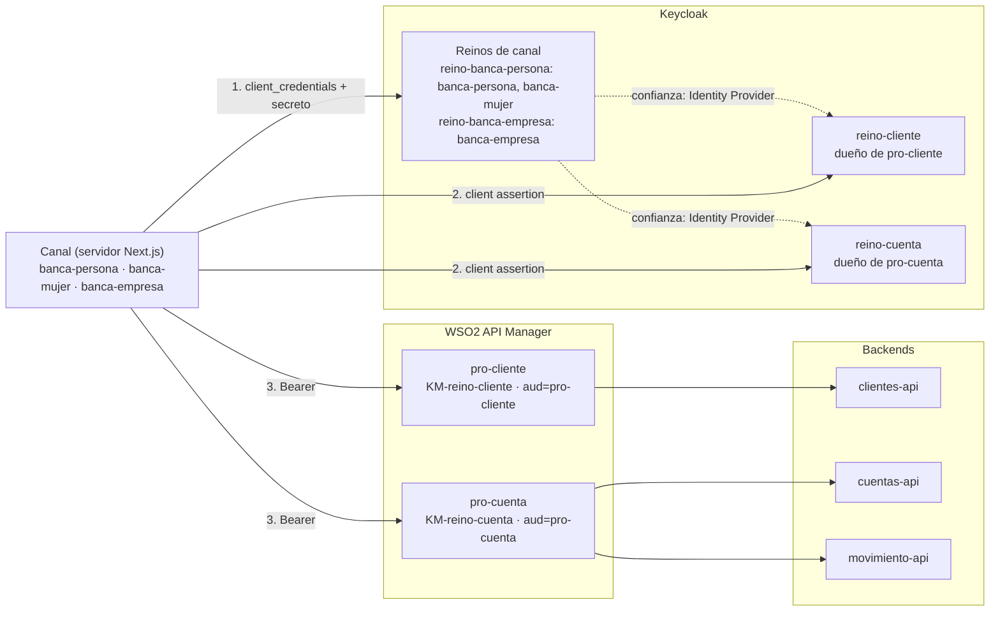
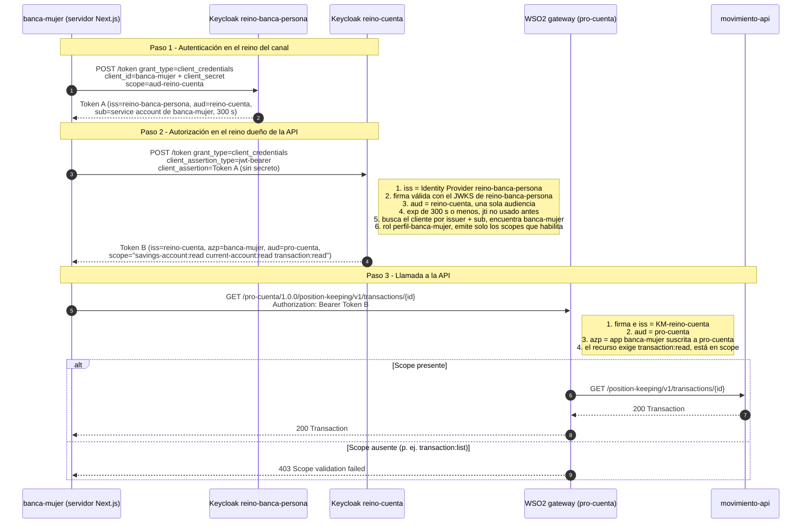

# Documentación del proyecto

Esta guía explica qué hace el proyecto, cuál es el objetivo de la arquitectura, cómo viaja una petición desde el canal hasta la API y qué se configuró en Keycloak y en WSO2. Para levantar el entorno y ver los endpoints, consulta el [README](README.md).

## 1. Qué es el proyecto

Es un banco de pruebas de **autenticación máquina a máquina (M2M) entre reinos de Keycloak**, con **WSO2 API Manager** como gateway.

- **3 APIs de backend** con modelo BIAN / ISO 20022:
  - `clientes-api`: datos de clientes y direcciones.
  - `cuentas-api`: cuentas de ahorro y corrientes.
  - `movimiento-api`: movimientos.
- **2 productos de WSO2** que agrupan esas APIs:
  - `pro-cliente`: `clientes-api`.
  - `pro-cuenta`: `cuentas-api` y `movimiento-api`.
- **2 reinos "dueños" de las APIs**, uno por producto: `reino-cliente` y `reino-cuenta`. Cada producto solo acepta tokens de su reino.
- **2 reinos de canal**: `reino-banca-persona` y `reino-banca-empresa`. Ahí se registran las aplicaciones consumidoras.
- **3 aplicaciones consumidoras (canales)**, hechas en Next.js:

| Aplicación | URL | Reino donde está registrada |
|---|---|---|
| banca-persona | http://localhost:3101 | `reino-banca-persona` |
| banca-empresa | http://localhost:3102 | `reino-banca-empresa` |
| banca-mujer | http://localhost:3103 | `reino-banca-persona` |

## 2. Objetivo de la arquitectura

**Que una aplicación tenga una sola identidad (un solo secreto) en el reino de su canal y pueda consumir APIs protegidas por otros reinos, donde el dueño de cada API decide qué puede hacer.**

Esto separa dos responsabilidades:

| Responsabilidad | Quién la tiene | Dónde |
|---|---|---|
| **Autenticación**: quién eres | El reino del canal | `reino-banca-persona`, `reino-banca-empresa` |
| **Autorización**: qué puedes hacer | El reino dueño de la API | `reino-cliente`, `reino-cuenta` |
| **Aplicación de la regla**: se deja pasar o no | El gateway | WSO2 (productos `pro-cliente`, `pro-cuenta`) |

### Qué se quiere probar

1. **Acceso entre reinos sin compartir secretos.** El canal solo tiene secreto en su reino y, aun así, obtiene tokens de `reino-cliente` y `reino-cuenta`.
2. **Aislamiento por producto.** `pro-cuenta` rechaza un token de `reino-cliente`, y viceversa (`setup/test-gateway.mjs`).
3. **Permisos por canal.** Cada canal solo accede a las operaciones que le habilita su rol en cada reino. El resto responde **403** (`setup/test-canales.mjs`).
4. **Varios canales en un mismo reino.** `banca-persona` y `banca-mujer` comparten `reino-banca-persona`, pero tienen permisos distintos.
5. **Casos que deben fallar:**
   - Reutilizar una assertion.
   - Usar un token con varias audiencias.
   - Presentar el token del canal directo en el gateway.

## 3. Arquitectura



- **Las flechas punteadas son confianza, no llamadas.** `reino-cliente` y `reino-cuenta` registran cada reino de canal como Identity Provider y validan sus tokens con su JWKS (claves públicas).
- **El navegador nunca ve tokens.** Keycloak y el gateway se consumen desde el servidor de Next.js (`lib/oauth.ts`, `lib/gateway.ts`).

## 4. Cómo funciona una petición

Ejemplo: `banca-mujer` consulta un movimiento (`GET /pro-cuenta/1.0.0/position-keeping/v1/transactions/{id}`).



### Pasos y reinos por petición

| # | Llamada | Reino / componente | Qué se obtiene |
|---|---|---|---|
| 1 | Client Credentials con secreto y `scope=aud-<reino destino>` | Reino del canal | **Token A**: identidad del canal, con una sola audiencia (el reino destino) |
| 2 | Client Credentials con `client_assertion=Token A` | Reino dueño de la API | **Token B**: permisos (scopes) según el rol del canal |
| 3 | `Bearer Token B` | WSO2 → backend | Respuesta de la API, o 401/403 |

- **Por cada reino de API** hay 2 llamadas a Keycloak y 1 al gateway. Si la aplicación consume de `reino-cliente` y `reino-cuenta`, repite los pasos 1 y 2 para cada uno.
- **La assertion es de un solo uso** (`jti`). Cada renovación del token B repite los pasos 1 y 2.
- **La app guarda en memoria el token B**, uno por reino de API, hasta poco antes de que venza. Ver [Qué token guardar en memoria](#qué-token-guardar-en-memoria).

### Qué token guardar en memoria

**Guarda solo el token B**, el access token que emite el reino dueño de la API. Guarda **uno por cada reino de API** que consumas y reúsalo en todas las llamadas al gateway hasta poco antes de que venza.

| Token | ¿Se guarda? | Por qué |
|---|---|---|
| **Token B** (emitido por `reino-cliente` o `reino-cuenta`) | **Sí**, uno por reino de API | Es el único que acepta el gateway. Sirve para muchas llamadas mientras no venza (300 s) |
| Token A (client assertion del reino del canal) | **No** | Es de **un solo uso** (`jti`): después del paso 2, Keycloak lo rechaza (`Token reuse detected`). Se pide uno nuevo en cada renovación |
| `client_secret` del canal | No es un token | Va en la configuración o en un gestor de secretos, nunca en el navegador ni en la caché |
| Refresh token | No existe | Client Credentials no emite refresh token (`refresh_token: null`). Para renovar se repiten los pasos 1 y 2 |

**Cómo se guarda:**

```
caché (memoria del servidor)
  reino-cliente → Token B de reino-cliente (aud=pro-cliente)   → para /pro-cliente/...
  reino-cuenta  → Token B de reino-cuenta  (aud=pro-cuenta)    → para /pro-cuenta/...
```

1. **Clave de la caché = reino de API (o producto).** El token de `reino-cuenta` no sirve para `pro-cliente`: tiene otro emisor y otra audiencia, y el gateway lo rechaza.
2. **Renueva antes de que venza.** Usa el `exp` del token o `expires_in`, con un margen. `tokenFor` en `lib/oauth.ts` renueva cuando faltan menos de 30 s: `exp - 30 > ahora`.
3. **Para renovar, repite la cadena completa** (pasos 1 y 2). Siempre se genera un token A nuevo.
4. **Una sola renovación a la vez.** Si llegan muchas peticiones cuando el token vence, todas deben esperar la misma renovación. `tokenFor` guarda la *promesa* en la caché, así que no se piden N tokens al mismo tiempo. Si la renovación falla, se borra de la caché para reintentar.
5. **Si el gateway responde 401,** descarta el token de ese reino y renueva una vez. Un **403** no se arregla renovando: el scope no está en el token, así que falta el permiso en Keycloak.
6. **Solo en el servidor.** El token B da acceso a las APIs: no lo envíes al navegador ni lo guardes en `localStorage`, cookies o logs.
7. **Varias instancias.** Cada instancia puede tener su propia caché en memoria: son 2 llamadas a Keycloak cada 5 min por reino. Si usas una caché compartida (por ejemplo Redis), guárdala cifrada y con un TTL igual al `exp` menos el margen.

Un permiso que se cambia en Keycloak aplica cuando se renueva el token B. Con 300 s de vida, eso ocurre en 5 minutos como máximo.

Implementación de referencia (`lib/oauth.ts`):

```ts
const cache = new Map<string, Promise<RealmToken>>();

export async function tokenFor(targetRealm: string): Promise<RealmToken> {
  const cached = cache.get(targetRealm);
  if (cached) {
    const token = await cached.catch(() => undefined);
    if (token && token.claims.exp - 30 > Date.now() / 1000) return token; // token B vigente
  }
  const pending = newTokenChain(targetRealm); // pasos 1 y 2: token A nuevo → token B nuevo
  cache.set(targetRealm, pending);
  pending.catch(() => cache.delete(targetRealm));
  return pending;
}
```

### Qué pasa antes de llegar a la API

La petición llega al backend solo si pasa **todas** estas validaciones:

1. **Keycloak del reino del canal:**
   - El secreto es correcto.
   - El canal puede pedir `aud-<reino>`, porque ese scope está asignado al cliente como opcional.
2. **Keycloak del reino de la API:**
   - Confía en el emisor, porque es un Identity Provider registrado.
   - La firma es válida.
   - La audiencia es única y correcta.
   - La assertion no venció y no se reutilizó.
   - Existe un cliente federado para ese `sub`.
   - Emite solo los scopes que habilita su rol.
3. **Gateway WSO2:**
   - El emisor es el Key Manager del producto.
   - La audiencia es la del producto.
   - La aplicación está suscrita.
   - El scope exigido por el recurso está en el token.

## 5. Rol y scope

### Diferencia

| | **Rol** | **Scope** |
|---|---|---|
| Qué describe | A qué tiene derecho **una identidad** | Qué permite **un token** |
| Se asigna a | Usuarios, service accounts o grupos | Clientes (como *Default* u *Optional*) |
| Dónde vive | Dentro de Keycloak (política interna del emisor) | En el claim `scope` del token (contrato con la API) |
| Quién lo revisa | Keycloak, al emitir el token | El gateway o la API, al recibir el token |
| Estándar | Propio de cada IdP (`realm_access.roles` en Keycloak) | OAuth 2.0 (RFC 6749) |
| Ejemplo | `perfil-banca-mujer` | `transaction:read` |

**Ninguno genera al otro.** El rol se asigna a la identidad, el scope se asigna al cliente, y el token lleva lo que resulta de cruzar las dos cosas:

```
scope en el token = el cliente tiene asignado el scope
                    Y (el scope no tiene roles mapeados, o la identidad tiene alguno de esos roles)
```

En este proyecto, **el rol habilita el scope**: el scope `transaction:read` tiene mapeados los roles `perfil-banca-empresa` y `perfil-banca-mujer`, así que solo esos canales lo reciben.

### Por qué los endpoints se protegen con scopes

1. **Es el estándar de OAuth 2.0.** WSO2 autoriza cada recurso por scope sin conocer los roles internos de Keycloak.
2. **Desacopla.** Si un reino renombra o reorganiza sus roles, el contrato con la API (el nombre del scope) no cambia.
3. **Mínimo privilegio.** El token para `pro-cuenta` solo lleva los scopes de ese producto, no todo lo que la identidad puede hacer.
4. **El rol queda como política del dueño.** El reino de la API decide con roles qué scopes emite a cada canal.

### Cuándo usar cada uno

- **Scope:** lo que la API exige y revisa, uno por operación o grupo de operaciones. Es un contrato estable.
- **Rol:** a qué tiene derecho una identidad. Sirve para decidir qué scopes emitir y, cuando hay usuarios, para la lógica de negocio dentro de la aplicación.
- **Solo M2M con pocos permisos:** se puede asignar el scope directo al cliente, sin rol.
- **Hay usuarios, perfiles reutilizables o gestión por consola:** conviene usar roles que habilitan scopes. Con usuarios, el rol es imprescindible, porque el scope solo no distingue a una persona de otra.

## 6. Configuración de Keycloak: conceptos básicos

Lo configura `setup/keycloak.mjs` a partir de `setup/config.mjs`. Es idempotente.

### Conceptos

| Concepto | Qué es | Uso en el proyecto |
|---|---|---|
| **Reino (realm)** | Espacio aislado con sus propios usuarios, clientes, roles y claves de firma | 4 reinos: 2 de canal y 2 dueños de API |
| **Cliente (client)** | Aplicación registrada en un reino | El canal en su reino (con secreto) y en los reinos de API (federado, sin secreto) |
| **Cliente confidencial** | Cliente que se autentica con una credencial (secreto, JWT firmado) | Todos los clientes de canal |
| **Service account** | Usuario técnico asociado a un cliente, para Client Credentials | Es el `sub` del token. Identifica al canal en los otros reinos |
| **Client Credentials** | Flujo OAuth 2.0 M2M: el cliente pide un token para sí mismo, sin usuario | Pasos 1 y 2 de la petición |
| **Client scope** | Plantilla reutilizable de claims y mappers que se asigna a clientes | `aud-<reino>`, `aud-pro-*` y los scopes de permiso |
| **Default / Optional** | *Default*: siempre se incluye. *Optional*: solo si se pide en `scope` | `aud-<reino>` es opcional en el canal, para pedir una sola audiencia |
| **Audience mapper** | Mapper que agrega un valor al claim `aud` | `aud-reino-cuenta` agrega `aud=reino-cuenta`, y `aud-pro-cuenta` agrega `aud=pro-cuenta` |
| **Rol de reino** | Permiso asignable a usuarios o service accounts | `perfil-<canal>` en cada reino de API |
| **Role scope mapping** | Roles de la pestaña *Scope* de un client scope. El scope solo va en el token si la identidad tiene uno de esos roles | Así se definen los `permissions` de cada canal |
| **fullScopeAllowed** | Si es `true`, todos los roles de la identidad van al token | `false` en el cliente del canal, para que no se agregue `aud=account` |
| **Identity Provider (OIDC)** | Otro emisor en el que el reino confía | Cada reino de API registra los reinos de canal (con `hideOnLogin` y `linkOnly`: no sirve para iniciar sesión) |
| **Federated client authentication** | El cliente se autentica con un JWT emitido por un Identity Provider (RFC 7523) | Autenticador **Signed JWT - Federated** (`federated-jwt`) |

### Reinos de canal (`reino-banca-persona`, `reino-banca-empresa`)

- **Cliente del canal** (`banca-persona`, `banca-mujer`, `banca-empresa`):
  - Confidencial, con secreto (`client-secret`) y service account.
  - Sin flujos de usuario.
  - `fullScopeAllowed=false`.
- **Client scopes `aud-reino-cliente` y `aud-reino-cuenta`:** asignados al canal como **opcionales**. El canal pide uno por vez para que el token A tenga una sola audiencia.
- **Duración de los tokens:** 300 s (`accessTokenLifespan`).

### Reinos de API (`reino-cliente`, `reino-cuenta`)

- **Client scope `aud-pro-<producto>`:** es *default* del reino y agrega la audiencia que exige el producto de WSO2.
- **Identity Provider `reino-banca-*`**, uno por reino de canal:
  - `supportsClientAssertions=true`: acepta tokens de ese reino como client assertion.
  - `allowClientIdAsAudience=true` con `clientId=<reino de API>`: la assertion debe traer `aud=<este reino>`.
  - `validateSignature=true` con `jwksUrl`: valida la firma con las claves públicas del reino del canal.
  - `supportsClientAssertionReuse=false`: cada `jti` se usa una sola vez.
  - `federatedClientAssertionMaxExpiration=300`: vida máxima de la assertion.
- **Cliente del canal**, uno por aplicación:
  - Autenticador `federated-jwt`, **sin secreto**.
  - `jwt.credential.issuer` = alias del Identity Provider (por ejemplo `reino-banca-persona`).
  - `jwt.credential.sub` = id del service account del canal en su reino.
  - Así se distinguen `banca-persona` y `banca-mujer`, aunque vengan del mismo reino.
- **Roles `perfil-<canal>`:** asignados al service account del cliente federado.
- **Scopes de permiso** (`party:list`, `transaction:read`, …): asignados como *default* a cada cliente de canal, con role scope mapping a los perfiles autorizados.
- **Cliente `wso2-km`:** con él WSO2 registra aplicaciones en el reino (DCR). Los canales no lo usan.

### Matriz de permisos actual

| Scope | Operación | banca-persona | banca-empresa | banca-mujer |
|---|---|:-:|:-:|:-:|
| `party:list` | Listar clientes | ✓ | — | ✓ |
| `party:read` | Consultar un cliente | ✓ | ✓ | — |
| `party-address:read` | Direcciones de un cliente | ✓ | — | — |
| `savings-account:read` | Cuentas de ahorro (lista y detalle) | ✓ | ✓ | ✓ |
| `current-account:read` | Cuentas corrientes (lista y detalle) | ✓ | ✓ | ✓ |
| `transaction:list` | Movimientos de una cuenta | ✓ | ✓ | — |
| `transaction:read` | Detalle de un movimiento | — | ✓ | ✓ |

## 7. Configuración de WSO2 (resumen)

Lo configura `setup/wso2.mjs`.

1. **Key Manager por reino** (`KM-reino-cliente`, `KM-reino-cuenta`), de tipo KeyCloak:
   - `issuer` igual al `iss` de los tokens.
   - JWKS para validar la firma y validación local del JWT (*self-validate*).
   - `consumerKeyClaim=azp` y `scopesClaim=scope`.
2. **APIs** importadas desde su OpenAPI:
   - Restringidas al Key Manager de su reino.
   - Exigen la audiencia del producto.
   - Tienen **scopes locales sin roles de WSO2**, y cada operación exige el suyo.
3. **Productos** `pro-cliente` y `pro-cuenta`: agrupan los recursos, exigen su audiencia y heredan el scope de cada recurso. Si cambian los scopes de una API, el producto se vuelve a desplegar.
4. **Aplicación por canal** en el Developer Portal:
   - Suscrita a los dos productos.
   - Con los clientes federados de cada reino asociados por *map-keys* (consumer key = nombre del canal, sin secreto).

## 8. Cómo extenderlo

- **Dar o quitar un permiso:** edita `permissions` del canal en `setup/config.mjs` y ejecuta `docker compose run --rm setup`. El cambio aplica en el siguiente token (hasta 5 min).
- **Nueva aplicación en un reino de canal existente:** agrégala a `CHANNELS` con el mismo `realm` (como `banca-mujer`) y ejecuta el setup.
- **Nuevo scope:** agrégalo a `SCOPES` con sus operaciones y súmalo a los `permissions` que correspondan. El setup lo crea en Keycloak y en WSO2, y vuelve a desplegar el producto.
- **Probar:**
  ```bash
  NODE_TLS_REJECT_UNAUTHORIZED=0 node setup/test-canales.mjs   # cadena, casos negativos y matriz 200/403 por canal
  NODE_TLS_REJECT_UNAUTHORIZED=0 node setup/test-gateway.mjs   # aislamiento de productos por reino
  ```
- **Ver una petición sin acceso:** en cualquier app, *Consulta* → una card en rojo → *Consultar* → pestaña *Paso a paso*.

## 9. Configuración manual de Keycloak desde la consola

Esta sección describe cómo dejar Keycloak igual que `setup/keycloak.mjs`, pero a mano desde la consola de administración de Keycloak 26.7. Sirve para entender cada pieza o para replicarla en otro Keycloak. Los nombres de menús y campos están en inglés, como aparecen en la consola.

> Si usas la consola, no ejecutes después `docker compose run --rm setup` sin revisar `setup/config.mjs`: el script es idempotente y vuelve a dejar los permisos como dice ese archivo.

Orden recomendado:

1. Reino `master` (Require SSL).
2. Reinos de canal: reino, client scopes de audiencia y clientes de canal.
3. Reinos de API: reino, scopes de audiencia y `default`, cliente `wso2-km`, roles, Identity Providers, scopes de permiso y clientes federados.
4. Verificación.

### 9.1 Entrar a la consola

- URL: `http://<PUBLIC_HOST>:8180/admin` (por ejemplo `http://localhost:8180/admin`). Usa el mismo host que `KC_HOSTNAME`; con otro host la consola no carga.
- Usuario y contraseña: `admin` / `admin` (`KC_BOOTSTRAP_ADMIN_USERNAME` y `KC_BOOTSTRAP_ADMIN_PASSWORD` en `docker-compose.yml`).
- El selector de reinos está arriba a la izquierda. Cada paso indica en qué reino se hace.

**Reino `master`:** *Realm settings* → pestaña *General* → **Require SSL** = `None` → *Save*. Keycloak corre por HTTP y, por defecto, exige HTTPS a las IPs que no son privadas (por ejemplo las `100.x` de Tailscale).

### 9.2 Crear un reino

Repite estos pasos para los 4 reinos:

| Realm name | Display name | Tipo |
|---|---|---|
| `reino-banca-persona` | Reino Banca Persona | Canal |
| `reino-banca-empresa` | Reino Banca Empresa | Canal |
| `reino-cliente` | Reino Clientes | API (`pro-cliente`) |
| `reino-cuenta` | Reino Cuentas | API (`pro-cuenta`) |

1. Selector de reinos → **Create realm**.
2. **Realm name** = el nombre de la tabla. **Enabled** = On → *Create*.
3. *Realm settings* → pestaña *General*:
   - **Display name** = el de la tabla.
   - **Require SSL** = `None`.
   - *Save*.
4. *Realm settings* → pestaña *Tokens* → **Access Token Lifespan** = `5` minutos (300 s) → *Save*.

### 9.3 Reinos de canal (`reino-banca-persona`, `reino-banca-empresa`)

Haz estos pasos en cada reino de canal.

#### a) Client scopes de audiencia `aud-reino-cliente` y `aud-reino-cuenta`

Cada uno agrega al token la audiencia de un reino de API. Crea los dos:

1. *Client scopes* → **Create client scope**:
   - **Name** = `aud-reino-cuenta` (y luego `aud-reino-cliente`).
   - **Description** = `Agrega aud=reino-cuenta a los access tokens del reino`.
   - **Type** = `None`. No debe ser default del reino: el canal lo pide solo cuando lo necesita.
   - **Protocol** = OpenID Connect.
   - **Display on consent screen** = Off.
   - **Include in token scope** = Off. No hace falta que aparezca en el claim `scope`.
   - *Save*.
2. Pestaña *Mappers* → **Configure a new mapper** → **Audience**:
   - **Name** = `audience-reino-cuenta`.
   - **Included Client Audience** = vacío.
   - **Included Custom Audience** = `reino-cuenta`.
   - **Add to ID token** = Off. **Add to access token** = On. **Add to token introspection** = On.
   - *Save*.

#### b) Cliente del canal

Un cliente por aplicación: `banca-persona` y `banca-mujer` en `reino-banca-persona`, `banca-empresa` en `reino-banca-empresa`.

1. *Clients* → **Create client**.
2. *General settings*:
   - **Client type** = OpenID Connect.
   - **Client ID** = `banca-mujer` (el nombre del canal).
   - **Name** = `Canal de banca mujer`. **Description** es opcional.
   - *Next*.
3. *Capability config*:
   - **Client authentication** = On (cliente confidencial).
   - **Authorization** = Off.
   - **Authentication flow**: marca solo **Service account roles**. Desmarca *Standard flow*, *Direct access grants* y el resto.
   - *Next*.
4. *Login settings*: deja todo vacío → *Save*.
5. Pestaña *Credentials*:
   - **Client Authenticator** = `Client Id and Secret`.
   - Copia el **Client Secret** y ponlo en `.env` (`BANCA_MUJER_CLIENT_SECRET`, `BANCA_PERSONA_CLIENT_SECRET` o `BANCA_EMPRESA_CLIENT_SECRET`). La consola genera el secreto y no permite escribir uno propio. El setup usa `<canal>-secret`.
6. Pestaña *Client scopes*:
   - **Add client scope** → marca `aud-reino-cliente` y `aud-reino-cuenta` → **Add** → **Optional**.
   - Si alguno quedó como *Default*, cámbialo a *Optional* en la columna **Assigned type**. Con *Default*, el token tendría dos audiencias y el reino de API lo rechaza (`Multiple audiences not allowed`).
7. Pestaña *Client scopes* → enlace `banca-mujer-dedicated` → pestaña *Scope* → **Full scope allowed** = Off. Si queda en On, Keycloak mete los roles por defecto del reino y agrega `aud=account`, así que otra vez hay varias audiencias.
8. Pestaña *Service account roles*: haz clic en el usuario `service-account-banca-mujer` y **copia su ID** (formato UUID). Ese ID es el `sub` de los tokens del canal y se usa como **Federated subject** en los reinos de API (paso 9.4 g).

### 9.4 Reinos de API (`reino-cliente`, `reino-cuenta`)

Haz estos pasos en cada reino de API. Los ejemplos usan `reino-cuenta`. En `reino-cliente`, cambia `pro-cuenta` por `pro-cliente`.

#### a) Client scope de audiencia del producto `aud-pro-cuenta`

1. *Client scopes* → **Create client scope**:
   - **Name** = `aud-pro-cuenta`.
   - **Type** = **Default**. Así lo reciben todos los clientes del reino, también los que crea WSO2 por DCR.
   - **Display on consent screen** = Off. **Include in token scope** = Off.
   - *Save*.
2. Pestaña *Mappers* → **Configure a new mapper** → **Audience**:
   - **Name** = `audience-pro-cuenta`.
   - **Included Custom Audience** = `pro-cuenta` (la audiencia que exige el producto en WSO2).
   - **Add to access token** = On. **Add to token introspection** = On. **Add to ID token** = Off.
   - *Save*.

Si el scope ya existía, puedes cambiar su tipo en la lista *Client scopes*, en la columna **Assigned type** → `Default`.

#### b) Client scope `default`

WSO2 pide `scope=default` cuando genera tokens (conector y Developer Portal). Si ese scope no existe, Keycloak responde `Invalid scopes`.

- *Client scopes* → **Create client scope**:
  - **Name** = `default`.
  - **Type** = **Optional**.
  - **Include in token scope** = On. **Display on consent screen** = Off.
  - *Save*.

#### c) Cliente `wso2-km`

WSO2 usa este cliente para registrar aplicaciones en el reino (DCR). Los canales no lo usan.

1. *Clients* → **Create client**:
   - **Client ID** = `wso2-km`. **Name** = `WSO2 API Manager - Key Manager`.
   - **Client authentication** = On.
   - **Authentication flow**: marca solo **Service account roles**.
   - *Save*.
2. Pestaña *Credentials*: copia el **Client Secret**. Debe coincidir con el que usa WSO2 en su Key Manager (`KEYCLOAK_WSO2_CLIENT_SECRET`, por defecto `wso2-km-secret`).
3. Pestaña *Client scopes*:
   - `aud-pro-cuenta` como **Default**.
   - `default` como **Optional**.
4. Pestaña *Service account roles* → **Assign role** → filtro **Filter by clients** → marca de `realm-management`:
   - `create-client`, `manage-clients`, `view-clients` y `query-clients`.
   - **Assign**.

#### d) Roles de perfil, uno por canal

- *Realm roles* → **Create role**, una vez por canal:

| Role name | Description |
|---|---|
| `perfil-banca-persona` | Permisos de banca-persona en reino-cuenta |
| `perfil-banca-empresa` | Permisos de banca-empresa en reino-cuenta |
| `perfil-banca-mujer` | Permisos de banca-mujer en reino-cuenta |

#### e) Identity Provider, uno por reino de canal

Registra cada reino de canal (`reino-banca-persona`, `reino-banca-empresa`) como emisor de confianza. Solo sirve para aceptar sus tokens como client assertion, no para iniciar sesión.

1. *Identity providers* → **OpenID Connect v1.0**.
2. Configuración general:

| Campo | Valor | Para qué |
|---|---|---|
| **Alias** | `reino-banca-persona` | Nombre del IdP. Se usa en el cliente federado |
| **Display name** | `Reino Banca Persona` | Solo para mostrar |
| **Use discovery endpoint** | Off | Los URL se escriben a mano |
| **Authorization URL** | `http://<PUBLIC_HOST>:8180/realms/reino-banca-persona/protocol/openid-connect/auth` | Obligatorio en el formulario. No se usa |
| **Token URL** | `http://localhost:8080/realms/reino-banca-persona/protocol/openid-connect/token` | Obligatorio en el formulario. No se usa |
| **Issuer** | `http://<PUBLIC_HOST>:8180/realms/reino-banca-persona` | Debe ser igual al `iss` de los tokens del canal (`KC_HOSTNAME`) |
| **Validate Signatures** | On | Verifica la firma de la assertion |
| **Use JWKS URL** | On | Las claves públicas se leen de un URL |
| **JWKS URL** | `http://localhost:8080/realms/reino-banca-persona/protocol/openid-connect/certs` | `localhost:8080` es Keycloak dentro de su propio contenedor |
| **Client authentication** | `JWT signed with private key` | No se usa. Evita tener que poner un secreto |
| **Client ID** | `reino-cuenta` | Audiencia que deben traer las assertions (el nombre de **este** reino) |

3. *Add* y luego, en la misma página, sección **Advanced settings**:

| Campo | Valor | Para qué |
|---|---|---|
| **Store tokens** | Off | |
| **Trust Email** | Off | |
| **Account linking only** | On | No sirve para iniciar sesión |
| **Hide on login page** | On | No aparece en la pantalla de login |
| **Sync mode** | `Legacy` | |
| **Supports client assertions** | **On** | Acepta tokens de este reino como `client_assertion` (RFC 7523) |
| **Allows client assertions to be re-used** | **Off** | Cada `jti` se usa una sola vez (`Token reuse detected`) |
| **Allows Client ID as audience for assertions** | **On** | La assertion debe traer `aud` igual al **Client ID** de arriba (`reino-cuenta`) |
| **Max expiration for Client Assertions** | **5 minutos** | Vida máxima de la assertion (300 s) |

4. *Save*.

#### f) Scopes de permiso

Un client scope por permiso de este reino, cada uno con los perfiles que lo pueden recibir.

- En `reino-cliente`: `party:list`, `party:read`, `party-address:read`.
- En `reino-cuenta`: `savings-account:read`, `current-account:read`, `transaction:list`, `transaction:read`.

1. *Client scopes* → **Create client scope**:
   - **Name** = `transaction:read`. **Description** = `Consultar un movimiento`.
   - **Type** = `None`. Se asigna cliente por cliente, no a todo el reino.
   - **Include in token scope** = **On**. Es lo que agrega el valor al claim `scope` que revisa WSO2.
   - **Display on consent screen** = Off.
   - *Save*.
2. Pestaña *Scope* → **Assign role** → filtro **Filter by realm roles** → marca los perfiles autorizados → **Assign**. Toma los perfiles de la [matriz de permisos](#matriz-de-permisos-actual). Por ejemplo, para `transaction:read`: `perfil-banca-empresa` y `perfil-banca-mujer`.

Con roles en la pestaña *Scope*, Keycloak solo pone el scope en el token si el service account tiene alguno de esos roles. **Para dar o quitar un permiso a un canal, agrega o quita su perfil en esta pestaña.**

#### g) Cliente federado del canal, uno por aplicación

El canal existe también en el reino de API, pero **sin secreto**: se autentica con el token de su reino.

1. *Clients* → **Create client**:
   - **Client ID** = `banca-mujer`. Usa el mismo nombre que en el reino del canal: WSO2 lo usa como consumer key (`azp`).
   - **Name** = `Canal de banca mujer`.
   - **Client authentication** = On.
   - **Authentication flow**: marca solo **Service account roles**.
   - *Save*.
2. Pestaña *Credentials*:

| Campo | Valor | Para qué |
|---|---|---|
| **Client Authenticator** | `Signed JWT - Federated` | Autenticador `federated-jwt` |
| **Identity provider** | `reino-banca-persona` | Alias del IdP del paso e), el reino donde está registrado el canal |
| **Federated subject** | ID del service account del canal en su reino (paso 9.3 b.8) | Distingue a `banca-persona` de `banca-mujer`, aunque vengan del mismo reino |

   *Save*.
3. Pestaña *Client scopes* → **Add client scope** → marca **todos** los scopes de permiso del reino → **Add** → **Default**. El rol de cada canal decide cuáles salen en su token.
4. Verifica que `aud-pro-cuenta` esté como **Default**. Si el scope ya era default del reino cuando creaste el cliente, aparece solo.
5. Pestaña *Service account roles* → **Assign role** → **Filter by realm roles** → `perfil-banca-mujer` → **Assign**.

### 9.5 Verificar

Pide los dos tokens con `curl` (ejemplo con `banca-mujer` hacia `reino-cuenta`):

```bash
KC=http://localhost:8180

# Paso 1: token A en el reino del canal, con una sola audiencia (reino-cuenta)
A=$(curl -s $KC/realms/reino-banca-persona/protocol/openid-connect/token \
  -d grant_type=client_credentials -d client_id=banca-mujer -d client_secret=banca-mujer-secret \
  -d scope=aud-reino-cuenta | jq -r .access_token)

# Paso 2: token B en el reino de la API, usando el token A como client assertion
curl -s $KC/realms/reino-cuenta/protocol/openid-connect/token \
  -d grant_type=client_credentials \
  -d client_assertion_type=urn:ietf:params:oauth:client-assertion-type:jwt-bearer \
  -d client_assertion=$A | jq -r .access_token | cut -d. -f2 | base64 -d 2>/dev/null | jq '{iss, azp, aud, scope}'
```

Resultado esperado (el host del `iss` es el de `KC_HOSTNAME`):

```json
{
  "iss": "http://localhost:8180/realms/reino-cuenta",
  "azp": "banca-mujer",
  "aud": ["pro-cuenta", "account"],
  "scope": "profile current-account:read email savings-account:read transaction:read"
}
```

- `aud` debe incluir `pro-cuenta`. `account` lo agregan los roles por defecto del reino. WSO2 lo ignora: solo exige que esté la audiencia del producto.
- `profile` y `email` son scopes por defecto de todo reino nuevo. WSO2 no los revisa.
- Lo que importa son los scopes de permiso: deben ser exactamente los del canal en la matriz.

Errores frecuentes:

| Error | Causa probable |
|---|---|
| `Invalid client or Invalid client credentials` en el paso 2 | El **Federated subject** no es el ID del service account, o el **Identity provider** del cliente no es el correcto |
| `Multiple audiences not allowed` | En el cliente del canal, `aud-reino-*` quedó como *Default* o **Full scope allowed** está en On |
| `Token reuse detected` | Se reutilizó el token A. Pide uno nuevo en cada paso 2 |
| Token B sin el scope esperado | Falta el perfil del canal en la pestaña *Scope* del scope de permiso, o falta el rol en *Service account roles* del cliente federado |
| Error de firma o de emisor en el paso 2 | El **Issuer** del IdP no coincide con el `iss` del token A (revisa `KC_HOSTNAME`), o el **JWKS URL** no responde desde el contenedor de Keycloak |
| `HTTPS required` | Falta **Require SSL** = `None` en el reino (o en `master` para la consola) |

### 9.6 Resumen de parámetros

| Dónde | Objeto | Parámetro | Valor |
|---|---|---|---|
| Todos los reinos y `master` | Realm settings → General | Require SSL | `None` |
| Todos los reinos | Realm settings → Tokens | Access Token Lifespan | 5 min |
| Reino de canal | Client scope `aud-reino-*` | Type / Include in token scope | `None` / Off |
| Reino de canal | Mapper Audience | Included Custom Audience | `reino-cliente` o `reino-cuenta` |
| Reino de canal | Cliente del canal | Client authentication / flujos | On / solo Service account roles |
| Reino de canal | Cliente del canal → Client scopes | `aud-reino-*` | Optional |
| Reino de canal | Cliente del canal → dedicated → Scope | Full scope allowed | Off |
| Reino de API | Client scope `aud-pro-*` | Type | Default (del reino) |
| Reino de API | Mapper Audience | Included Custom Audience | `pro-cliente` o `pro-cuenta` |
| Reino de API | Client scope `default` | Type / Include in token scope | Optional / On |
| Reino de API | Cliente `wso2-km` → Service account roles | `realm-management` | create-client, manage-clients, view-clients, query-clients |
| Reino de API | Realm roles | Roles | `perfil-<canal>` |
| Reino de API | Identity Provider `reino-banca-*` | Issuer / JWKS URL / Client ID | `iss` del reino del canal / `certs` del reino del canal / nombre del reino de API |
| Reino de API | Identity Provider → Advanced | Supports client assertions / re-use / Client ID as audience / Max expiration | On / Off / On / 5 min |
| Reino de API | Identity Provider → Advanced | Account linking only / Hide on login page | On / On |
| Reino de API | Scope de permiso | Type / Include in token scope | `None` / On |
| Reino de API | Scope de permiso → Scope | Roles | Perfiles autorizados (matriz de permisos) |
| Reino de API | Cliente federado → Credentials | Client Authenticator / Identity provider / Federated subject | Signed JWT - Federated / alias del IdP / ID del service account en el reino del canal |
| Reino de API | Cliente federado → Client scopes | Scopes de permiso | Default |
| Reino de API | Cliente federado → Service account roles | Rol | `perfil-<canal>` |

## 10. Configuración manual de WSO2 desde las consolas

Esta sección describe cómo dejar WSO2 API Manager 4.7 igual que `setup/wso2.mjs`, a mano desde sus consolas. Asume que Keycloak ya está configurado como en la [sección 9](#9-configuración-manual-de-keycloak-desde-la-consola).

Los ejemplos usan `reino-cuenta` / `pro-cuenta` / `movimiento-api`. Repite cada paso con los valores de la otra fila de esta tabla:

| Reino de Keycloak | Key Manager | Producto (y audiencia) | APIs |
|---|---|---|---|
| `reino-cliente` | `KM-reino-cliente` | `pro-cliente` | `clientes-api` |
| `reino-cuenta` | `KM-reino-cuenta` | `pro-cuenta` | `cuentas-api`, `movimiento-api` |

Orden recomendado:

1. Requisitos del servidor (`deployment.toml`).
2. Key Managers (consola Admin).
3. APIs: importar, restringir al Key Manager, exigir audiencia, scopes, desplegar y publicar (Publisher).
4. API Products (Publisher).
5. Aplicaciones de los canales: suscripciones y claves (Developer Portal).
6. Verificación.

### 10.1 Requisitos del servidor

Ya vienen en `wso2/deployment.toml` y `docker-compose.yml`. Revísalos si montas otro WSO2:

- **`[server] hostname`** = el host público (`PUBLIC_HOST`). Las consolas redirigen a ese host al iniciar sesión.
- **`[[apim.gateway.environment]]`** `Default`: `http_endpoint` y `https_endpoint` con el host público. Es el *vhost* donde se despliegan las APIs.
- **`[encryption] key`** = `WSO2_ENCRYPTION_KEY`. Cifra secretos guardados, como el `client_secret` de los Key Managers.
- **Red:** WSO2 debe llegar a Keycloak (`http://keycloak:8080`) y a los backends (`http://clientes-api:3001`, `http://cuentas-api:3002`, `http://movimiento-api:3003`).

Consolas (usuario `admin` / `admin`):

| Consola | URL | Se usa para |
|---|---|---|
| Admin | `https://<PUBLIC_HOST>:9443/admin` | Key Managers |
| Publisher | `https://<PUBLIC_HOST>:9443/publisher` | APIs y productos |
| Developer Portal | `https://<PUBLIC_HOST>:9443/devportal` | Aplicaciones, suscripciones y claves |

Si el login de una consola falla por *callback URL mismatch*, sigue [Cambiar de host](README.md#cambiar-de-host-ip--localhost-y-callback-de-las-consolas-de-wso2) en el README.

### 10.2 Key Manager por reino

Un Key Manager le dice a WSO2 qué emisor de tokens aceptar y cómo validarlos. Hay uno por reino de API. Cada API se restringe después al suyo.

1. Consola **Admin** → menú *Key Managers* → **Add Key Manager**.
2. **General Details**:
   - **Name** = `KM-reino-cuenta`. Las APIs lo referencian por este nombre.
   - **Display Name** = `Keycloak reino-cuenta`. Es el nombre que muestran el Publisher y el Developer Portal.
   - **Description** = `Reino Cuentas: emisor de tokens del producto pro-cuenta`.
3. **Key Manager Type**:
   - **Key Manager Type** = `KeyCloak`.
   - **API Invocation Method**: marca solo **Direct Token**. El canal presenta directamente el token que emite Keycloak.
4. **Key Manager Endpoints** → **Well-known URL** = `http://keycloak:8080/realms/reino-cuenta/.well-known/openid-configuration` → **Import**. WSO2 llena los endpoints usando el host interno `keycloak:8080`, que es el correcto para las llamadas de servidor a servidor.
5. Revisa los endpoints importados y corrige los que no deben apuntar al host interno:

| Campo | Valor | Por qué |
|---|---|---|
| **Issuer** | `http://<PUBLIC_HOST>:8180/realms/reino-cuenta` | Debe ser **idéntico** al `iss` del token B. Keycloak emite con `KC_HOSTNAME`, no con `keycloak:8080`. Si no coincide, el gateway rechaza el token |
| **Client Registration Endpoint** | `http://keycloak:8080/realms/reino-cuenta/clients-registrations/openid-connect` | DCR desde WSO2 (red interna) |
| **Introspection Endpoint** | `http://keycloak:8080/realms/reino-cuenta/protocol/openid-connect/token/introspect` | Red interna |
| **Token Endpoint** | `http://keycloak:8080/realms/reino-cuenta/protocol/openid-connect/token` | Red interna |
| **Display Token Endpoint** | `http://<PUBLIC_HOST>:8180/realms/reino-cuenta/protocol/openid-connect/token` | El que muestra el Developer Portal |
| **Revoke Endpoint** | `http://keycloak:8080/realms/reino-cuenta/protocol/openid-connect/revoke` | Red interna |
| **Display Revoke Endpoint** | `http://<PUBLIC_HOST>:8180/realms/reino-cuenta/protocol/openid-connect/revoke` | El que muestra el Developer Portal |
| **UserInfo Endpoint** | `http://keycloak:8080/realms/reino-cuenta/protocol/openid-connect/userinfo` | |
| **Authorize Endpoint** | `http://<PUBLIC_HOST>:8180/realms/reino-cuenta/protocol/openid-connect/auth` | No se usa en M2M |
| **Scope Management Endpoint** | Vacío | Los scopes los administra Keycloak |

6. **Claim URIs**:
   - **Consumer Key Claim URI** = **`azp`**. Es el claim con el que WSO2 identifica la aplicación. En el token B vale `banca-mujer`.
   - **Scopes Claim URI** = **`scope`**. Es el claim del que WSO2 lee los scopes para autorizar cada recurso.
7. **Grant Types**: escribe `client_credentials` y pulsa *Enter*. Borra los demás.
8. **Certificates**: elige **JWKS** y en **URL** pon `http://keycloak:8080/realms/reino-cuenta/protocol/openid-connect/certs`. Con esto el gateway valida la firma del token sin llamar a Keycloak en cada petición.
9. **Connector Configurations**:
   - **Client ID** = `wso2-km`.
   - **Client Secret** = el secreto de `wso2-km` en ese reino (paso 9.4 c).
10. **Permissions** → **Key Manager Permission** = `Public`.
11. **Advanced Configurations**:

| Opción | Valor | Por qué |
|---|---|---|
| **Token Generation** | On | Permite generar tokens de prueba desde el Developer Portal |
| **Out Of Band Provisioning** | **On** | Necesario para asociar a las aplicaciones los clientes de Keycloak que ya existen (paso 10.5) |
| **Oauth App Creation** | On | WSO2 puede crear clientes en Keycloak por DCR (opcional para el demo) |
| **Token Validation Method** | **Self validate JWT** | Valida el JWT localmente (firma, emisor, vencimiento) |

12. **Add**. Para editar uno existente, el botón es **Update**.

El alta se propaga dentro de WSO2 en unos segundos. Si al crear una API aparece *Key Manager not Registered* (901403), espera y vuelve a intentar.

### 10.3 APIs

Repite para `clientes-api`, `cuentas-api` y `movimiento-api`.

| API | Context | Backend | OpenAPI | Key Manager | Audiencia |
|---|---|---|---|---|---|
| `clientes-api` | `/clientes` | `http://clientes-api:3001` | `http://clientes-api:3001/openapi.json` | `Keycloak reino-cliente` | `pro-cliente` |
| `cuentas-api` | `/cuentas` | `http://cuentas-api:3002` | `http://cuentas-api:3002/openapi.json` | `Keycloak reino-cuenta` | `pro-cuenta` |
| `movimiento-api` | `/movimientos` | `http://movimiento-api:3003` | `http://movimiento-api:3003/openapi.json` | `Keycloak reino-cuenta` | `pro-cuenta` |

#### a) Importar

1. **Publisher** → *Create API* → **Import OpenAPI**.
2. Paso **Provide OpenAPI**:
   - **Input Type** = **OpenAPI URL**.
   - **OpenAPI URL** = `http://movimiento-api:3003/openapi.json`. Haz clic fuera del campo para que lo valide.
   - *Next*.
3. Paso **Create API**:
   - **Name** = `movimiento-api`.
   - **Context** = `/movimientos`.
   - **Version** = `1.0.0`.
   - **Endpoint** = `http://movimiento-api:3003`.
   - *Create*.
4. *Develop* → *API Configurations* → **Resources**: borra el recurso `GET /health` → *Save*. Es operativo y no se expone en el gateway.
5. *Portal Configurations* → **Subscriptions** → **Business Plans**: marca `Unlimited` → *Save*.

#### b) Restringir al Key Manager y exigir la audiencia

*Develop* → *API Configurations* → **Runtime** → *Request* → despliega **Application Level Security**:

| Campo | Valor | Por qué |
|---|---|---|
| **OAuth2** | Marcado. *Basic* y *Api Key* desmarcados | Solo tokens OAuth |
| **Mandatory** | Marcado | La seguridad de aplicación es obligatoria |
| **Audience Validation** | On | Exige una audiencia en el token |
| **Allowed Audience** | `pro-cuenta` (escríbelo y pulsa *Enter*) | El token B trae `aud=pro-cuenta` por el scope `aud-pro-cuenta` de Keycloak |
| **Key Manager Configuration** | **Allow selected** | No aceptar cualquier emisor |
| **Select one or more Key Managers** | `Keycloak reino-cuenta` | La API rechaza tokens de cualquier otro emisor |

*Save*.

#### c) Scopes por operación

1. *API Configurations* → **Local Scopes** → **Add New Local Scope**. Pantalla **Create New Scope**, una vez por permiso de la API:
   - **Name** = `transaction:read` (el mismo nombre que el client scope de Keycloak).
   - **Display Name** = `transaction:read`.
   - **Description** = `Consultar un movimiento`.
   - **Roles** = vacío. No se usan roles de WSO2: quien decide es Keycloak al emitir el token.
   - *Save*.
2. *Develop* → *API Configurations* → **Resources** → despliega cada operación → **Operation scope** = el scope que le corresponde → al final, *Save*.

| API | Operación | Scope |
|---|---|---|
| `clientes-api` | `GET /party-reference-data-directory/v1/parties` | `party:list` |
| `clientes-api` | `GET /party-reference-data-directory/v1/parties/{partyIdentification}` | `party:read` |
| `clientes-api` | `GET /party-reference-data-directory/v1/parties/{partyIdentification}/addresses` | `party-address:read` |
| `cuentas-api` | `GET /savings-account/v1/parties/{partyIdentification}/savings-accounts` | `savings-account:read` |
| `cuentas-api` | `GET /savings-account/v1/savings-accounts/{savingsAccountId}` | `savings-account:read` |
| `cuentas-api` | `GET /current-account/v1/parties/{partyIdentification}/current-accounts` | `current-account:read` |
| `cuentas-api` | `GET /current-account/v1/current-accounts/{currentAccountId}` | `current-account:read` |
| `movimiento-api` | `GET /position-keeping/v1/accounts/{accountNumber}/transactions` | `transaction:list` |
| `movimiento-api` | `GET /position-keeping/v1/transactions/{transactionId}` | `transaction:read` |

Todas las operaciones deben tener un scope. Una operación sin scope aceptaría cualquier token válido del reino.

#### d) Desplegar y publicar

1. *Deploy* → **Deployments** → **Deploy New Revision**:
   - Gateway `Default`.
   - Vhost = el host público (`PUBLIC_HOST`).
   - *Deploy*.
   - En la tabla *Gateways*, **Deployment Status** debe decir *Successfully Deployed*.
2. *Publish* → **Lifecycle** → **Publish**.

Cada cambio posterior (Key Manager, audiencia, scopes) necesita **una revisión nueva desplegada**. El gateway sirve la última revisión desplegada, no la configuración guardada.

### 10.4 API Products

| Producto | Context | Recursos | Audiencia |
|---|---|---|---|
| `pro-cliente` | `/pro-cliente` | Todos los de `clientes-api` | `pro-cliente` |
| `pro-cuenta` | `/pro-cuenta` | Todos los de `cuentas-api` y `movimiento-api` | `pro-cuenta` |

1. **Publisher** → *API Products* → **Create API Product**.
2. Paso **Define API Product**:
   - **Name** = `pro-cuenta`.
   - **Context** = `/pro-cuenta`.
   - **Version** = `1.0.0`.
   - *Next*.
3. Paso **Add Resources**: en *Select an API*, elige `cuentas-api` → **Add All**. Repite con `movimiento-api` → *Save*.
   - Cada recurso conserva el scope que tiene en su API, así que la API debe tener sus scopes **antes** de agregarla al producto.
   - Para cambiar los recursos después: *Develop* → **Resources** (*Manage Resources*).
4. *Overview* o *Basic Info*: **Description** = `Producto de cuentas: ahorro, corriente y movimientos. Solo acepta tokens de reino-cuenta.` **Visibility** = `Public`.
5. *API Configurations* → **Runtime** → **Application Level Security** → **Audience Validation** = On, **Allowed Audience** = `pro-cuenta` → *Save*. El producto no tiene selector de Key Manager: usa el de sus APIs, así que solo acepta tokens de `reino-cuenta`.
6. *Portal Configurations* → **Business Plan**: `Unlimited` → *Save*.
7. *Deploy* → **Deployments** → **Deploy New Revision** en `Default` con el vhost público → *Publish* → **Lifecycle** → **Publish**.

Si después cambias los scopes de una API, **vuelve a desplegar también el producto**: su revisión desplegada guarda los scopes del momento en que se creó.

### 10.5 Aplicaciones de los canales

Una aplicación por canal (`banca-persona`, `banca-empresa`, `banca-mujer`). WSO2 no crea sus claves: se asocian los clientes federados que ya existen en cada reino de API. Así el gateway reconoce el `azp` del token B como una aplicación suscrita.

1. **Developer Portal** → *Applications* → **ADD NEW APPLICATION**:
   - **Application Name** = `banca-mujer`.
   - **Shared Quota for Application Tokens** = `Unlimited`. El valor por defecto es `10PerMin`: cámbialo.
   - **Application Description** = `Canal de banca mujer`.
   - **SAVE**. El tipo de token es JWT por defecto.
2. *Subscriptions* → **Subscribed APIs** → **SUBSCRIBE**: suscribe la aplicación a `pro-cliente` y a `pro-cuenta` con el plan `Unlimited`.
3. *Production Keys* → **OAuth2 Tokens** → pestaña **KEYCLOAK REINO-CUENTA** → **PROVIDE EXISTING OAUTH KEYS**:
   - **Consumer Key** = `banca-mujer`. Es el Client ID del cliente federado en `reino-cuenta` y el `azp` del token B.
   - **Consumer Secret** = vacío. El cliente federado no tiene secreto.
   - **PROVIDE**.
4. Repite el paso 3 en la pestaña **KEYCLOAK REINO-CLIENTE**.
5. Comprueba que cada pestaña muestre **Consumer Key** = `banca-mujer` y, en *Key Configurations*, el **Token Endpoint** público del reino.

No uses **GENERATE KEYS** en las pestañas de Keycloak. Eso crea en Keycloak otro cliente con otro `client_id`, y el `azp` de los tokens de la cadena no coincidiría con la aplicación. La pestaña *RESIDENT KEY MANAGER* (el emisor propio de WSO2) no se usa.

El setup hace el paso 3 con la API REST del Developer Portal (`POST /api/am/devportal/v3/applications/{id}/map-keys` con `{"consumerKey":"banca-mujer","consumerSecret":"","keyManager":"KM-reino-cuenta","keyType":"PRODUCTION"}`).

### 10.6 Verificar

Con el token B del [paso 9.5](#95-verificar) (`banca-mujer` → `reino-cuenta`):

```bash
GW=https://<PUBLIC_HOST>:8243

# transaction:read está en el token → 200
curl -sk -H "Authorization: Bearer $B" $GW/pro-cuenta/1.0.0/position-keeping/v1/transactions/MOV-20260905-000027

# transaction:list no está en el token → 403
curl -sk -H "Authorization: Bearer $B" $GW/pro-cuenta/1.0.0/position-keeping/v1/accounts/2200145678/transactions
```

O ejecuta las pruebas completas:

```bash
NODE_TLS_REJECT_UNAUTHORIZED=0 node setup/test-canales.mjs   # cadena, casos negativos y matriz 200/403 por canal
NODE_TLS_REJECT_UNAUTHORIZED=0 node setup/test-gateway.mjs   # aislamiento de productos por reino
```

Errores frecuentes:

| Respuesta del gateway | Causa probable |
|---|---|
| **401** `900901` *Invalid Credentials* | El **Issuer** del Key Manager no es igual al `iss` del token, el JWKS no responde desde WSO2, o el token venció |
| **403** `900910` *Scope validation failed* | El scope del recurso no está en el token. Revisa la matriz de permisos en Keycloak (sección 9.4 f). Renovar el token no lo arregla |
| **403** `900908` *Resource forbidden* / no suscrita | La aplicación no está suscrita al producto, o su **Consumer Key** no es igual al `azp` del token |
| **401/403** por audiencia | El token no trae `aud=<producto>` (falta `aud-pro-*` como Default en Keycloak) o la audiencia configurada en la API o el producto es otra |
| **404** | El producto no está desplegado en el vhost con el que llamas, o la revisión aún se está desplegando |
| **500** `900900` *Unclassified Authentication Failure* | El emisor del token no es un Key Manager registrado. Por ejemplo, si se presenta el token A del reino del canal |

### 10.7 Resumen de parámetros

| Dónde | Objeto | Parámetro | Valor |
|---|---|---|---|
| `deployment.toml` | `[server]` | hostname | `PUBLIC_HOST` |
| `deployment.toml` | Gateway `Default` | http/https endpoint | `PUBLIC_HOST` (vhost) |
| Admin | Key Manager | Name / Type | `KM-<reino>` / KeyCloak |
| Admin | Key Manager | Well-known URL | `http://keycloak:8080/realms/<reino>/.well-known/openid-configuration` |
| Admin | Key Manager | Issuer | `http://<PUBLIC_HOST>:8180/realms/<reino>` (igual al `iss`) |
| Admin | Key Manager | Certificates | JWKS `http://keycloak:8080/realms/<reino>/protocol/openid-connect/certs` |
| Admin | Key Manager | Grant Types | `client_credentials` |
| Admin | Key Manager | Client ID / Secret | `wso2-km` / su secreto |
| Admin | Key Manager | API Invocation Method | Direct Token |
| Admin | Key Manager | Token Validation Method / Out Of Band Provisioning | Self validate JWT / On |
| Admin | Key Manager | Consumer Key Claim / Scopes Claim | `azp` / `scope` |
| Publisher | API | Key Manager Configuration | Allow selected: `Keycloak <reino dueño>` |
| Publisher | API | Audience Validation / Allowed Audience | On / `pro-<producto>` |
| Publisher | API | Local Scopes | Los de su reino, sin roles |
| Publisher | API | Operation scope | Uno por operación (tabla 10.3 c) |
| Publisher | API y producto | Business plan | `Unlimited` |
| Publisher | API y producto | Deploy | Revisión en `Default`, vhost `PUBLIC_HOST`, luego Publish |
| Publisher | Producto | Resources / Audience Validation | Todos los de sus APIs / `pro-<producto>` |
| Developer Portal | Aplicación | Application Name / Shared Quota | `<canal>` / Unlimited |
| Developer Portal | Aplicación | Suscripciones | `pro-cliente` y `pro-cuenta` |
| Developer Portal | Aplicación → Production Keys → pestaña de cada Keycloak | Provide Existing OAuth Keys | Consumer Key = `<canal>`, Consumer Secret vacío |

## 11. Actualizar el issuer

### Qué es el issuer

El **issuer** es el claim `iss` de un token: indica **quién lo emitió**. Keycloak lo arma con `KC_HOSTNAME` más el nombre del reino:

```
iss = http://<PUBLIC_HOST>:8180/realms/<reino>
```

- **No depende de la URL con que se pide el token.** Los canales y WSO2 llaman a Keycloak por la red interna (`http://keycloak:8080`), pero el `iss` sale siempre con el host público. Eso lo hace `KC_HOSTNAME` en `docker-compose.yml`. `KC_HOSTNAME_BACKCHANNEL_DYNAMIC=true` permite que los endpoints internos (token, JWKS, DCR) sigan respondiendo en `keycloak:8080`.
- **Es un texto que se compara tal cual.** `http://localhost:8180/realms/reino-cuenta` y `http://192.168.1.50:8180/realms/reino-cuenta` son emisores distintos, aunque sean el mismo Keycloak.

### Para qué sirve en este proyecto

Hay dos lugares que **confían en un emisor por su issuer**. Cada uno guarda una copia del issuer esperado y la compara con el `iss` del token que recibe:

| Dónde se configura | Qué token revisa | Qué issuer espera | Para qué lo usa |
|---|---|---|---|
| Keycloak, reinos `reino-cliente` y `reino-cuenta` → Identity Provider `reino-banca-*` → **Issuer** | Token A (client assertion, paso 2) | `http://<PUBLIC_HOST>:8180/realms/reino-banca-persona` (o `-empresa`) | Encontrar el Identity Provider del emisor y validar la assertion con su JWKS |
| WSO2, consola Admin → Key Manager `KM-reino-*` → **Issuer** | Token B (Bearer en el gateway, paso 3) | `http://<PUBLIC_HOST>:8180/realms/reino-cliente` (o `reino-cuenta`) | Encontrar el Key Manager del token, validar la firma y decidir qué APIs lo aceptan |

Además hay campos que muestran URLs públicas, pero no validan nada:

- En el Identity Provider: **Authorization URL**.
- En el Key Manager: **Display Token Endpoint** y **Display Revoke Endpoint**, que el Developer Portal muestra en *Key Configurations*.

### Cuándo hay que actualizarlo

Cuando cambia el `iss` que emite Keycloak:

- Cambias `PUBLIC_HOST` en `.env` (de `localhost` a una IP, de una IP a otra o a un nombre DNS).
- Cambias el puerto publicado de Keycloak (`8180`) o pasas de `http` a `https` en `KC_HOSTNAME`.

**No** hace falta actualizar las URLs internas:

- `keycloak:8080` en los endpoints del Key Manager.
- `localhost:8080` en el JWKS URL de los Identity Providers.
- `KEYCLOAK_URL` y `GATEWAY_URL` de los canales.

Todas usan la red interna de Docker y no dependen del host público.

### Qué pasa si no se actualiza

Keycloak empieza a emitir tokens con el `iss` nuevo, pero los dos lugares siguen esperando el viejo:

| Paso | Lo que falla | Síntoma |
|---|---|---|
| 2 (Keycloak del reino de API) | El `iss` del token A no coincide con ningún Identity Provider | `401 invalid_client` (*Invalid client or Invalid client credentials*) al pedir el token B |
| 3 (gateway WSO2) | El `iss` del token B no coincide con ningún Key Manager | El gateway responde `500 900900 Unclassified Authentication Failure` aunque el token sea válido |
| Developer Portal | Los *Display* endpoints muestran el host viejo | Solo es visual: el `curl` de ejemplo apunta a un host que ya no existe |

En las aplicaciones, cualquier consulta en *Consulta* termina en error, y la pestaña *Paso a paso* muestra en cuál de los dos pasos se cortó.

### Qué corrige la actualización

| Objeto | Campo | Antes | Después | Efecto |
|---|---|---|---|---|
| Identity Provider `reino-banca-*` (en `reino-cliente` y `reino-cuenta`) | **Issuer** | `http://<host viejo>:8180/realms/reino-banca-*` | `http://<host nuevo>:8180/realms/reino-banca-*` | El reino de API vuelve a aceptar el token A como client assertion (paso 2) |
| Identity Provider `reino-banca-*` | **Authorization URL** | Host viejo | Host nuevo | Solo consistencia: no se usa en M2M |
| Key Manager `KM-reino-*` | **Issuer** | `http://<host viejo>:8180/realms/reino-*` | `http://<host nuevo>:8180/realms/reino-*` | El gateway vuelve a reconocer el token B y lo valida con su Key Manager (paso 3) |
| Key Manager `KM-reino-*` | **Display Token Endpoint** / **Display Revoke Endpoint** | Host viejo | Host nuevo | El Developer Portal muestra URLs que funcionan |
| APIs y productos | Vhost del despliegue | Host viejo | Host nuevo | El gateway publica las URLs con el host nuevo |

La actualización **no** cambia claves, clientes, roles, scopes ni suscripciones. Solo corrige el texto con que cada lado reconoce al emisor.

Después de actualizar:

- **Tokens viejos:** los emitidos antes del cambio llevan el `iss` anterior y fallan hasta que vencen (5 min como máximo).
- **Caché de los canales:** cada canal renueva su token B al vencer, o cuando el gateway responde 401 (ver [Qué token guardar en memoria](#qué-token-guardar-en-memoria)). No hay que reiniciar los canales.

### Cómo actualizarlo

#### Automático (recomendado)

```bash
sed -i "s/^PUBLIC_HOST=.*/PUBLIC_HOST=192.168.1.50/" .env
docker compose up -d        # recrea keycloak, wso2am y setup, y ejecuta el setup
```

El job `setup` compara lo configurado con el host actual y corrige solo lo que difiere:

- **`setup/keycloak.mjs` → `ensureChannelIdentityProvider`:** si el **Issuer** (o cualquier otro campo) del Identity Provider no coincide, lo actualiza. Consola: `~ Identity Provider reino-banca-persona actualizado en reino-cuenta`.
- **`setup/wso2.mjs` → `reconcileKeyManager`:** si el **Issuer** del Key Manager no coincide, actualiza el Issuer y los *Display* endpoints, y vuelve a enviar el secreto de `wso2-km` (la API devuelve el secreto enmascarado). Consola: `~ Key Manager KM-reino-cuenta actualizado: issuer ... → ...`.
- **`setup/wso2.mjs` → `ensureVhost`:** vuelve a desplegar APIs y productos en el vhost nuevo.

El setup **no** actualiza **Revoke Endpoint** ni **Authorize Endpoint** del Key Manager. Pueden quedar con un host anterior sin afectar al demo: el flujo Client Credentials no los usa.

El callback de login de las consolas de WSO2 es otro problema: no lo corrige el setup. Ver [Cambiar de host](README.md#cambiar-de-host-ip--localhost-y-callback-de-las-consolas-de-wso2).

#### Manual (desde las consolas)

1. **Keycloak** (`http://<host nuevo>:8180/admin`): en `reino-cliente` y en `reino-cuenta`, *Identity providers* → `reino-banca-persona`:
   - **Issuer** = `http://<host nuevo>:8180/realms/reino-banca-persona`.
   - **Authorization URL** = `http://<host nuevo>:8180/realms/reino-banca-persona/protocol/openid-connect/auth`.
   - *Save*.
   - Repite con `reino-banca-empresa`. En total son 4 Identity Providers: 2 reinos de API × 2 reinos de canal.
2. **WSO2 Admin** (`https://<host nuevo>:9443/admin`): *Key Managers* → `KM-reino-cliente`:
   - **Issuer** = `http://<host nuevo>:8180/realms/reino-cliente`.
   - **Display Token Endpoint** = `http://<host nuevo>:8180/realms/reino-cliente/protocol/openid-connect/token`.
   - **Display Revoke Endpoint** = `http://<host nuevo>:8180/realms/reino-cliente/protocol/openid-connect/revoke`.
   - **Authorize Endpoint** = `http://<host nuevo>:8180/realms/reino-cliente/protocol/openid-connect/auth`.
   - Si **Revoke Endpoint** tiene un host público, cámbialo por el interno: `http://keycloak:8080/realms/reino-cliente/protocol/openid-connect/revoke`.
   - **Update**. Si la consola pide el **Client Secret**, vuelve a escribir el de `wso2-km`.
   - Repite con `KM-reino-cuenta`.
3. **WSO2 Publisher:** en cada API y producto, *Deployments* → **Deploy New Revision** con el vhost nuevo.

### Verificar

```bash
H=192.168.1.50   # host nuevo

# 1. El issuer que publica Keycloak
curl -s http://$H:8180/realms/reino-cuenta/.well-known/openid-configuration | jq -r .issuer

# 2. El iss de un token real (debe ser idéntico al anterior)
curl -s http://$H:8180/realms/reino-banca-persona/protocol/openid-connect/token \
  -d grant_type=client_credentials -d client_id=banca-mujer -d client_secret=banca-mujer-secret \
  | jq -r .access_token | cut -d. -f2 | base64 -d 2>/dev/null | jq -r .iss

# 3. La cadena completa: pasos 1, 2 y 3 con la matriz de permisos
NODE_TLS_REJECT_UNAUTHORIZED=0 node setup/test-canales.mjs
```

Para comparar a mano, el issuer configurado se ve en:

- Keycloak → reino de API → *Identity providers* → `reino-banca-*` → **Issuer**.
- WSO2 Admin → *Key Managers* → `KM-reino-*` → **Issuer**.

Los dos deben ser iguales, carácter por carácter, al `iss` de los tokens.
