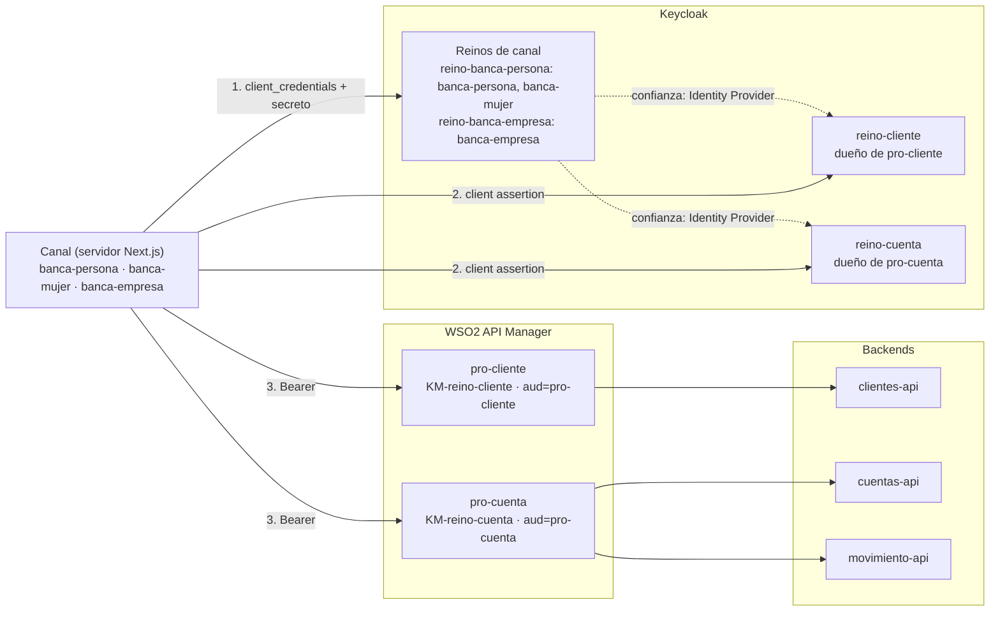
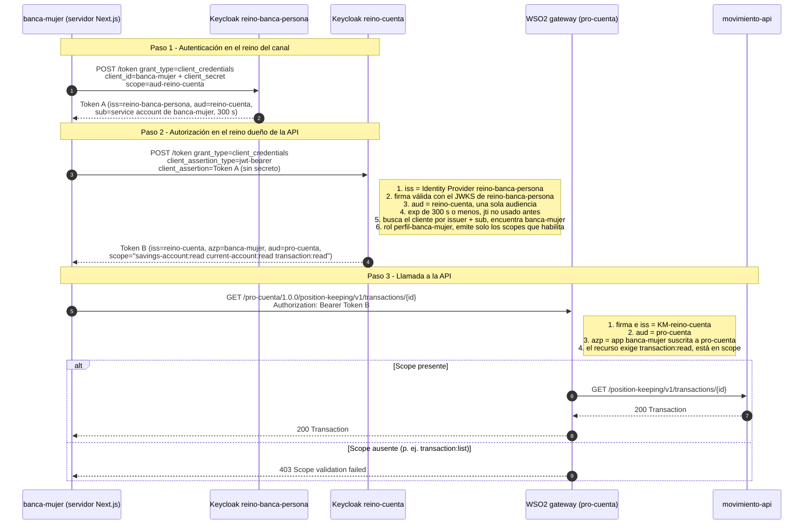

# Documentación del proyecto

Esta guía explica qué hace el proyecto, cuál es el objetivo de la arquitectura, cómo viaja una petición desde el canal hasta la API y qué se configuró en Keycloak y en WSO2. Para levantar el entorno y ver los endpoints, consulta el [README](README.md).

## 1. Qué es el proyecto

Es un banco de pruebas de **autenticación máquina a máquina (M2M) entre reinos de Keycloak**, con **WSO2 API Manager** como gateway.

- **3 APIs de backend** con modelo BIAN / ISO 20022:
  - `clientes-api`: datos de clientes y direcciones.
  - `cuentas-api`: cuentas de ahorro y corrientes.
  - `movimiento-api`: movimientos.
- **2 productos de WSO2** que agrupan esas APIs:
  - `pro-cliente`: `clientes-api`.
  - `pro-cuenta`: `cuentas-api` y `movimiento-api`.
- **2 reinos "dueños" de las APIs**, uno por producto: `reino-cliente` y `reino-cuenta`. Cada producto solo acepta tokens de su reino.
- **2 reinos de canal**: `reino-banca-persona` y `reino-banca-empresa`. Ahí se registran las aplicaciones consumidoras.
- **3 aplicaciones consumidoras (canales)**, hechas en Next.js:

| Aplicación | URL | Reino donde está registrada |
|---|---|---|
| banca-persona | http://localhost:3101 | `reino-banca-persona` |
| banca-empresa | http://localhost:3102 | `reino-banca-empresa` |
| banca-mujer | http://localhost:3103 | `reino-banca-persona` |

## 2. Objetivo de la arquitectura

**Que una aplicación tenga una sola identidad (un solo secreto) en el reino de su canal y pueda consumir APIs protegidas por otros reinos, donde el dueño de cada API decide qué puede hacer.**

Esto separa dos responsabilidades:

| Responsabilidad | Quién la tiene | Dónde |
|---|---|---|
| **Autenticación**: quién eres | El reino del canal | `reino-banca-persona`, `reino-banca-empresa` |
| **Autorización**: qué puedes hacer | El reino dueño de la API | `reino-cliente`, `reino-cuenta` |
| **Aplicación de la regla**: se deja pasar o no | El gateway | WSO2 (productos `pro-cliente`, `pro-cuenta`) |

### Qué se quiere probar

1. **Acceso entre reinos sin compartir secretos.** El canal solo tiene secreto en su reino y, aun así, obtiene tokens de `reino-cliente` y `reino-cuenta`.
2. **Aislamiento por producto.** `pro-cuenta` rechaza un token de `reino-cliente`, y viceversa (`setup/test-gateway.mjs`).
3. **Permisos por canal.** Cada canal solo accede a las operaciones que le habilita su rol en cada reino. El resto responde **403** (`setup/test-canales.mjs`).
4. **Varios canales en un mismo reino.** `banca-persona` y `banca-mujer` comparten `reino-banca-persona`, pero tienen permisos distintos.
5. **Casos que deben fallar:**
   - Reutilizar una assertion.
   - Usar un token con varias audiencias.
   - Hacer Token Exchange directo entre reinos.
   - Presentar el token del canal directo en el gateway.
6. **Sin Token Exchange.** En Keycloak 26.7, el Token Exchange estándar (RFC 8693) solo funciona **dentro** de un reino. Tampoco hace falta: la pieza que cruza reinos es la **client assertion federada (RFC 7523)**.

## 3. Arquitectura



- **Las flechas punteadas son confianza, no llamadas.** `reino-cliente` y `reino-cuenta` registran cada reino de canal como Identity Provider y validan sus tokens con su JWKS (claves públicas).
- **El navegador nunca ve tokens.** Keycloak y el gateway se consumen desde el servidor de Next.js (`lib/oauth.ts`, `lib/gateway.ts`).

## 4. Cómo funciona una petición

Ejemplo: `banca-mujer` consulta un movimiento (`GET /pro-cuenta/1.0.0/position-keeping/v1/transactions/{id}`).



### Pasos y reinos por petición

| # | Llamada | Reino / componente | Qué se obtiene |
|---|---|---|---|
| 1 | Client Credentials con secreto y `scope=aud-<reino destino>` | Reino del canal | **Token A**: identidad del canal, con una sola audiencia (el reino destino) |
| 2 | Client Credentials con `client_assertion=Token A` | Reino dueño de la API | **Token B**: permisos (scopes) según el rol del canal |
| 3 | `Bearer Token B` | WSO2 → backend | Respuesta de la API, o 401/403 |

- **Por cada reino de API** hay 2 llamadas a Keycloak y 1 al gateway. Si la aplicación consume de `reino-cliente` y `reino-cuenta`, repite los pasos 1 y 2 para cada uno.
- **La assertion es de un solo uso** (`jti`). Cada renovación del token B repite los pasos 1 y 2.
- **La app guarda en memoria el token B**, uno por reino de API, hasta poco antes de que venza. Ver [Qué token guardar en memoria](#qué-token-guardar-en-memoria).

### Qué token guardar en memoria

**Guarda solo el token B**, el access token que emite el reino dueño de la API. Guarda **uno por cada reino de API** que consumas y reúsalo en todas las llamadas al gateway hasta poco antes de que venza.

| Token | ¿Se guarda? | Por qué |
|---|---|---|
| **Token B** (emitido por `reino-cliente` o `reino-cuenta`) | **Sí**, uno por reino de API | Es el único que acepta el gateway. Sirve para muchas llamadas mientras no venza (300 s) |
| Token A (client assertion del reino del canal) | **No** | Es de **un solo uso** (`jti`): después del paso 2, Keycloak lo rechaza (`Token reuse detected`). Se pide uno nuevo en cada renovación |
| `client_secret` del canal | No es un token | Va en la configuración o en un gestor de secretos, nunca en el navegador ni en la caché |
| Refresh token | No existe | Client Credentials no emite refresh token (`refresh_token: null`). Para renovar se repiten los pasos 1 y 2 |

**Cómo se guarda:**

```
caché (memoria del servidor)
  reino-cliente → Token B de reino-cliente (aud=pro-cliente)   → para /pro-cliente/...
  reino-cuenta  → Token B de reino-cuenta  (aud=pro-cuenta)    → para /pro-cuenta/...
```

1. **Clave de la caché = reino de API (o producto).** El token de `reino-cuenta` no sirve para `pro-cliente`: tiene otro emisor y otra audiencia, y el gateway lo rechaza.
2. **Renueva antes de que venza.** Usa el `exp` del token o `expires_in`, con un margen. `tokenFor` en `lib/oauth.ts` renueva cuando faltan menos de 30 s: `exp - 30 > ahora`.
3. **Para renovar, repite la cadena completa** (pasos 1 y 2). Siempre se genera un token A nuevo.
4. **Una sola renovación a la vez.** Si llegan muchas peticiones cuando el token vence, todas deben esperar la misma renovación. `tokenFor` guarda la *promesa* en la caché, así que no se piden N tokens al mismo tiempo. Si la renovación falla, se borra de la caché para reintentar.
5. **Si el gateway responde 401,** descarta el token de ese reino y renueva una vez. Un **403** no se arregla renovando: el scope no está en el token, así que falta el permiso en Keycloak.
6. **Solo en el servidor.** El token B da acceso a las APIs: no lo envíes al navegador ni lo guardes en `localStorage`, cookies o logs.
7. **Varias instancias.** Cada instancia puede tener su propia caché en memoria: son 2 llamadas a Keycloak cada 5 min por reino. Si usas una caché compartida (por ejemplo Redis), guárdala cifrada y con un TTL igual al `exp` menos el margen.

Un permiso que se cambia en Keycloak aplica cuando se renueva el token B. Con 300 s de vida, eso ocurre en 5 minutos como máximo.

Implementación de referencia (`lib/oauth.ts`):

```ts
const cache = new Map<string, Promise<RealmToken>>();

export async function tokenFor(targetRealm: string): Promise<RealmToken> {
  const cached = cache.get(targetRealm);
  if (cached) {
    const token = await cached.catch(() => undefined);
    if (token && token.claims.exp - 30 > Date.now() / 1000) return token; // token B vigente
  }
  const pending = newTokenChain(targetRealm); // pasos 1 y 2: token A nuevo → token B nuevo
  cache.set(targetRealm, pending);
  pending.catch(() => cache.delete(targetRealm));
  return pending;
}
```

### Qué pasa antes de llegar a la API

La petición llega al backend solo si pasa **todas** estas validaciones:

1. **Keycloak del reino del canal:**
   - El secreto es correcto.
   - El canal puede pedir `aud-<reino>`, porque ese scope está asignado al cliente como opcional.
2. **Keycloak del reino de la API:**
   - Confía en el emisor, porque es un Identity Provider registrado.
   - La firma es válida.
   - La audiencia es única y correcta.
   - La assertion no venció y no se reutilizó.
   - Existe un cliente federado para ese `sub`.
   - Emite solo los scopes que habilita su rol.
3. **Gateway WSO2:**
   - El emisor es el Key Manager del producto.
   - La audiencia es la del producto.
   - La aplicación está suscrita.
   - El scope exigido por el recurso está en el token.

## 5. Rol y scope

### Diferencia

| | **Rol** | **Scope** |
|---|---|---|
| Qué describe | A qué tiene derecho **una identidad** | Qué permite **un token** |
| Se asigna a | Usuarios, service accounts o grupos | Clientes (como *Default* u *Optional*) |
| Dónde vive | Dentro de Keycloak (política interna del emisor) | En el claim `scope` del token (contrato con la API) |
| Quién lo revisa | Keycloak, al emitir el token | El gateway o la API, al recibir el token |
| Estándar | Propio de cada IdP (`realm_access.roles` en Keycloak) | OAuth 2.0 (RFC 6749) |
| Ejemplo | `perfil-banca-mujer` | `transaction:read` |

**Ninguno genera al otro.** El rol se asigna a la identidad, el scope se asigna al cliente, y el token lleva lo que resulta de cruzar las dos cosas:

```
scope en el token = el cliente tiene asignado el scope
                    Y (el scope no tiene roles mapeados, o la identidad tiene alguno de esos roles)
```

En este proyecto, **el rol habilita el scope**: el scope `transaction:read` tiene mapeados los roles `perfil-banca-empresa` y `perfil-banca-mujer`, así que solo esos canales lo reciben.

### Por qué los endpoints se protegen con scopes

1. **Es el estándar de OAuth 2.0.** WSO2 autoriza cada recurso por scope sin conocer los roles internos de Keycloak.
2. **Desacopla.** Si un reino renombra o reorganiza sus roles, el contrato con la API (el nombre del scope) no cambia.
3. **Mínimo privilegio.** El token para `pro-cuenta` solo lleva los scopes de ese producto, no todo lo que la identidad puede hacer.
4. **El rol queda como política del dueño.** El reino de la API decide con roles qué scopes emite a cada canal.

### Cuándo usar cada uno

- **Scope:** lo que la API exige y revisa, uno por operación o grupo de operaciones. Es un contrato estable.
- **Rol:** a qué tiene derecho una identidad. Sirve para decidir qué scopes emitir y, cuando hay usuarios, para la lógica de negocio dentro de la aplicación.
- **Solo M2M con pocos permisos:** se puede asignar el scope directo al cliente, sin rol.
- **Hay usuarios, perfiles reutilizables o gestión por consola:** conviene usar roles que habilitan scopes. Con usuarios, el rol es imprescindible, porque el scope solo no distingue a una persona de otra.

## 6. Configuración de Keycloak: conceptos básicos

Lo configura `setup/keycloak.mjs` a partir de `setup/config.mjs`. Es idempotente.

### Conceptos

| Concepto | Qué es | Uso en el proyecto |
|---|---|---|
| **Reino (realm)** | Espacio aislado con sus propios usuarios, clientes, roles y claves de firma | 4 reinos: 2 de canal y 2 dueños de API |
| **Cliente (client)** | Aplicación registrada en un reino | El canal en su reino (con secreto) y en los reinos de API (federado, sin secreto) |
| **Cliente confidencial** | Cliente que se autentica con una credencial (secreto, JWT firmado) | Todos los clientes de canal |
| **Service account** | Usuario técnico asociado a un cliente, para Client Credentials | Es el `sub` del token. Identifica al canal en los otros reinos |
| **Client Credentials** | Flujo OAuth 2.0 M2M: el cliente pide un token para sí mismo, sin usuario | Pasos 1 y 2 de la petición |
| **Client scope** | Plantilla reutilizable de claims y mappers que se asigna a clientes | `aud-<reino>`, `aud-pro-*` y los scopes de permiso |
| **Default / Optional** | *Default*: siempre se incluye. *Optional*: solo si se pide en `scope` | `aud-<reino>` es opcional en el canal, para pedir una sola audiencia |
| **Audience mapper** | Mapper que agrega un valor al claim `aud` | `aud-reino-cuenta` agrega `aud=reino-cuenta`, y `aud-pro-cuenta` agrega `aud=pro-cuenta` |
| **Rol de reino** | Permiso asignable a usuarios o service accounts | `perfil-<canal>` en cada reino de API |
| **Role scope mapping** | Roles de la pestaña *Scope* de un client scope. El scope solo va en el token si la identidad tiene uno de esos roles | Así se definen los `permissions` de cada canal |
| **fullScopeAllowed** | Si es `true`, todos los roles de la identidad van al token | `false` en el cliente del canal, para que no se agregue `aud=account` |
| **Identity Provider (OIDC)** | Otro emisor en el que el reino confía | Cada reino de API registra los reinos de canal (con `hideOnLogin` y `linkOnly`: no sirve para iniciar sesión) |
| **Federated client authentication** | El cliente se autentica con un JWT emitido por un Identity Provider (RFC 7523) | Autenticador **Signed JWT - Federated** (`federated-jwt`) |

### Reinos de canal (`reino-banca-persona`, `reino-banca-empresa`)

- **Cliente del canal** (`banca-persona`, `banca-mujer`, `banca-empresa`):
  - Confidencial, con secreto (`client-secret`) y service account.
  - Sin flujos de usuario.
  - Token Exchange deshabilitado y `fullScopeAllowed=false`.
- **Client scopes `aud-reino-cliente` y `aud-reino-cuenta`:** asignados al canal como **opcionales**. El canal pide uno por vez para que el token A tenga una sola audiencia.
- **Duración de los tokens:** 300 s (`accessTokenLifespan`).

### Reinos de API (`reino-cliente`, `reino-cuenta`)

- **Client scope `aud-pro-<producto>`:** es *default* del reino y agrega la audiencia que exige el producto de WSO2.
- **Identity Provider `reino-banca-*`**, uno por reino de canal:
  - `supportsClientAssertions=true`: acepta tokens de ese reino como client assertion.
  - `allowClientIdAsAudience=true` con `clientId=<reino de API>`: la assertion debe traer `aud=<este reino>`.
  - `validateSignature=true` con `jwksUrl`: valida la firma con las claves públicas del reino del canal.
  - `supportsClientAssertionReuse=false`: cada `jti` se usa una sola vez.
  - `federatedClientAssertionMaxExpiration=300`: vida máxima de la assertion.
- **Cliente del canal**, uno por aplicación:
  - Autenticador `federated-jwt`, **sin secreto**.
  - `jwt.credential.issuer` = alias del Identity Provider (por ejemplo `reino-banca-persona`).
  - `jwt.credential.sub` = id del service account del canal en su reino.
  - Así se distinguen `banca-persona` y `banca-mujer`, aunque vengan del mismo reino.
- **Roles `perfil-<canal>`:** asignados al service account del cliente federado.
- **Scopes de permiso** (`party:list`, `transaction:read`, …): asignados como *default* a cada cliente de canal, con role scope mapping a los perfiles autorizados.
- **Cliente `wso2-km`:** con él WSO2 registra aplicaciones en el reino (DCR). Los canales no lo usan.

### Matriz de permisos actual

| Scope | Operación | banca-persona | banca-empresa | banca-mujer |
|---|---|:-:|:-:|:-:|
| `party:list` | Listar clientes | ✓ | — | ✓ |
| `party:read` | Consultar un cliente | ✓ | ✓ | — |
| `party-address:read` | Direcciones de un cliente | ✓ | — | — |
| `savings-account:read` | Cuentas de ahorro (lista y detalle) | ✓ | ✓ | ✓ |
| `current-account:read` | Cuentas corrientes (lista y detalle) | ✓ | ✓ | ✓ |
| `transaction:list` | Movimientos de una cuenta | ✓ | ✓ | — |
| `transaction:read` | Detalle de un movimiento | — | ✓ | ✓ |

## 7. Configuración de WSO2 (resumen)

Lo configura `setup/wso2.mjs`.

1. **Key Manager por reino** (`KM-reino-cliente`, `KM-reino-cuenta`), de tipo KeyCloak:
   - `issuer` igual al `iss` de los tokens.
   - JWKS para validar la firma y validación local del JWT (*self-validate*).
   - `consumerKeyClaim=azp` y `scopesClaim=scope`.
2. **APIs** importadas desde su OpenAPI:
   - Restringidas al Key Manager de su reino.
   - Exigen la audiencia del producto.
   - Tienen **scopes locales sin roles de WSO2**, y cada operación exige el suyo.
3. **Productos** `pro-cliente` y `pro-cuenta`: agrupan los recursos, exigen su audiencia y heredan el scope de cada recurso. Si cambian los scopes de una API, el producto se vuelve a desplegar.
4. **Aplicación por canal** en el Developer Portal:
   - Suscrita a los dos productos.
   - Con los clientes federados de cada reino asociados por *map-keys* (consumer key = nombre del canal, sin secreto).

## 8. Cómo extenderlo

- **Dar o quitar un permiso:** edita `permissions` del canal en `setup/config.mjs` y ejecuta `docker compose run --rm setup`. El cambio aplica en el siguiente token (hasta 5 min).
- **Nueva aplicación en un reino de canal existente:** agrégala a `CHANNELS` con el mismo `realm` (como `banca-mujer`) y ejecuta el setup.
- **Nuevo scope:** agrégalo a `SCOPES` con sus operaciones y súmalo a los `permissions` que correspondan. El setup lo crea en Keycloak y en WSO2, y vuelve a desplegar el producto.
- **Probar:**
  ```bash
  NODE_TLS_REJECT_UNAUTHORIZED=0 node setup/test-canales.mjs   # cadena, casos negativos y matriz 200/403 por canal
  NODE_TLS_REJECT_UNAUTHORIZED=0 node setup/test-gateway.mjs   # aislamiento de productos por reino
  ```
- **Ver una petición sin acceso:** en cualquier app, *Consulta* → una card en rojo → *Consultar* → pestaña *Paso a paso*.
